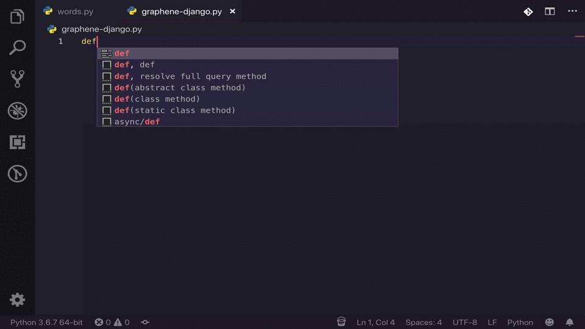

# Graphene Django Snippets and AutoComplete

Graphene Django Snippets and AutoComplete is a django graphene extension that gives graphene django snippets and minimum autocompletion functionality.

## Features

Some popular commands include:
* command "!query": Query class with two reslove methods
* command "!mutate" : mutate method with info and **kwargs params
* command "!fullquery" : mininum skeleton of the query class
* command "!fullmutate" : mininum skeleton of the mutate class

Some more features in the extension include graphene django regular code snippets ranging from query skeletons to graphene types and some autocompletion functionality.

Minimum Skeleton for Mutations and Queries snippets:

resolve methods and info contexts with is_authenticated() and is_anonymous() methods options:

Model types skeleton snippets:

Schemas can be run as well, together with a path snippet for the urls.py file:

With some of the popular autocompletes for graphene django:

## Release Notes

This is the initial release of the graphene snippets extension.

### 1.0.0

Initial release of Graphene Django Snippets

**Enjoy!**
